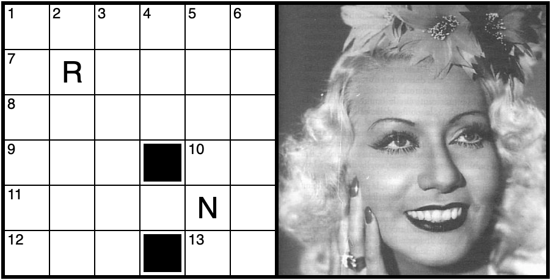
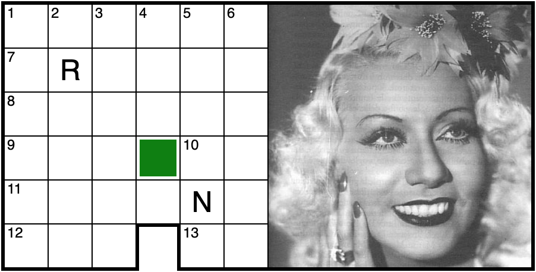
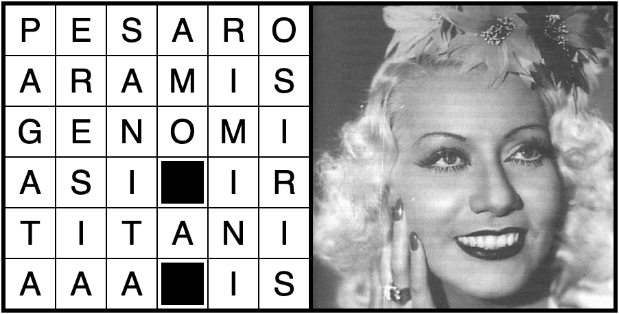

# Crossword Grid

Crossword Grid is a JavaScript component for rendering crossword grids that supports a [variety of printable rendering styles](https://ascottix.github.io/cwgrid/gallery.html).

## Background

I was looking for a small, weekend-size project that would let me play a bit with CSS grids and eventually settled on rendering crossword grids, in particular with the styles used by the [most famous Italian magazine](https://www.lasettimanaenigmistica.com/).

The resulting component is relatively simple (supporting the _modern_ style introduced some complications) but gets the job done nicely and indeed using CSS grids was fun and instructive.

## Usage

Just call the function `generateGridHtml()` with a schema definition as a parameter, and put the generated HTML somewhere in your page. Together with the component's CSS, it will render the schema grid.

Indeed, this is practical only in very simple scenarios. In larger projects, the above should be wrapped in a "real" component, and the CSS scoped.

### Rendering options

The component supports several rendering options, which are controlled by CSS classes.

The default _classic_ style renders black cells in black with a small white border.



The _modern_ style hides all black cells that are placed on the grid border, this can produce some interesting effects. It also renders black cells in green and uses a lighter border on pictures. Check the gallery for examples.

To enable the modern style, add the CSS class `modern` to the grid container.



When the grid container has the CSS class `revealed`, it displays the solved grid. This typically goes together with the class `hide-numbers`, which hides the numbers.



There are many more classes and variables that allow finer control over the rendered grid, check the [gallery](https://ascottix.github.io/cwgrid/gallery.html) for a list of examples.

## Schema definition

A crossword schema is a JSON object with the following structure:

```js
{
    author: {
        name: 'Alessandro Scotti', // Name of the author
        moniker: 'A. Scotti' // Nickname of the author, used for display
    },
    license: "CC-BY-SA-4.0", // Schema license
    lang: "IT", // Schema language
    id: "1", // Schema identifier (e.g. a progressive number)
    created: "20240809", // Creation date (and optionally time) in ISO 8601 format
    grid: [ // Grid definition
        'pesaro1', // This '1' marks the upper-left corner of the picture placeholder
        'aramis', // Trailing blanks are optional
        'genomi',
        'asi ir',
        'titani',
        'aaa is     1' // This '1' sets the bottom-right corner of the picture
    ],
    hints: { // Hint letters are always shown
        7: 2, // 2nd letter of the word at 7 horizontal (`R`)
        11: 5 // 5th letter of the word at 11 horizontal (`N`)
    },
    picture: 'wanda.jpg', // URL of picture to embed in the schema
    definitions: { // Word definitions, horizontal and vertical
        h: {
            1: "Fa provincia con Urbino",
            7: "Uno dei tre moschettieri",
            8: "Contengono le informazioni genetiche",
            9: "Dèi norreni",
            10: "Al centro di Beirut",
            11: "I figli di Urano",
            12: "Pile ministilo",
            13: "L'Islanda nei siti Internet"
        }
        v: {
            1: "Retribuita",
            2: "Dottrina non ortodossa",
            3: "Quella pubblica tutela la nostra salute",
            4: "Trappola uncinata",
            5: "Città non distante dall'1 orizzontale",
            6: "La Wanda soubrette in figura"
        }
    },
    caption: "", // Schema caption, can be used to provide special instructions, etc.
    notes: "" // Free text annotations, not intended for display
}
```

The only attribute required to generate a grid is `grid`, all the rest is optional.

By default, there is one letter per cell. To create groups of letters, use the '`-`' (dash) character as a separator. For example:
* `mattone` defines 7 cells: `m`, `a`, `t`, `t`, `o`, `n` and `e`;
* `mat-to-ne` defines 3 cells: `mat`, `to` and `ne`.

Black cells (word separators) are represented with '` `' (a space). It is also possible to use:
* '`.`' (a dot), it means that in the _modern_ style it will be rendered as a hole;
* '`?`' (a question mark), it means that the black cells is blank until _revealed_.

You can embed a picture in the schema, by defining a _placeholder area_. A placeholder area is a rectangle delimited by a '`1`' (the digit _one_) in the upper left corner and another '`1`' in the lower right corner. The rest of the area must be filled with blanks.

If defined, the placeholder area is filled with the picture specified in the `picture` attribute.

Note that trailing blanks are optional. Shorter lines are automatically padded to the length of the longest line, so the grid in the above example is the same as:

```js
    grid: [
        'pesaro1     ',
        'aramis      ',
        'genomi      ',
        'asi ir      ',
        'titani      ',
        'aaa is     1'
    ]
```

Hint letters, if defined, are always shown. Hint letters are declared as key/value pairs in the `hints` attribute using the following convention:
* the key is the number of the horizontal word
* the value represents the n-th letter of the word identified by the key

### Dividers

Some schemas do not use black cells to separate words, but instead use _dividers_.

There are two types of dividers:
* a vertical bar, declared with the character `|` (pipe), separates two horizontal words;
* a horizontal bar, declared with the character `_` (underscore), separates two vertical words.

Dividers are declared *before* the letter they refer to.

For example in the following grid:

```js
    grid: [
        '_foo|bar',
        'kernel',
    ]
```

there are three horizontal words (`foo`, `bar`, `arcade`) and only five 2-letter vertical words, because there is a divider between the `f` and the `k`.

## Acknowledgements

The picture [wanda.jpg](https://commons.wikimedia.org/wiki/File:Wanda_Osiris.jpg) is Public Domain from Wikimedia Commons.

The picture [anstett.jpg](https://commons.wikimedia.org/wiki/File:Dorothy_Anstett,_Miss_USA,_1968-bluish_tint_fix_attempt.jpg) is No Known Copyright Restrictions from Wikimedia Commons.

[Parolecon IT](https://www.parolecon.it/) is a fantastic tool for solving and composing crossword puzzles in many languages!

## License

Copyright © 2024 Alessandro Scotti

This software is released under the terms of the [MIT License](https://mit-license.org/).
